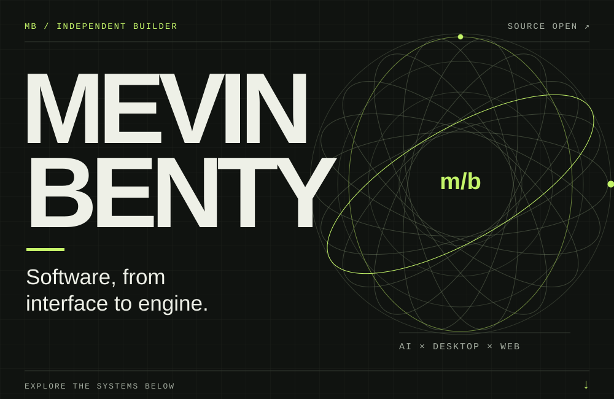
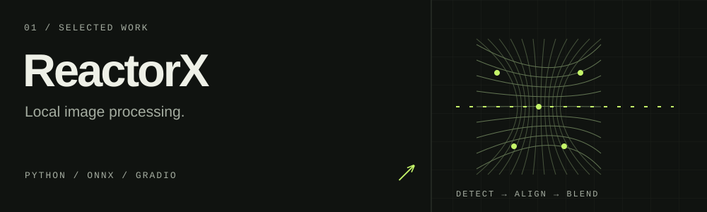
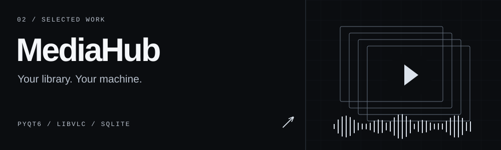
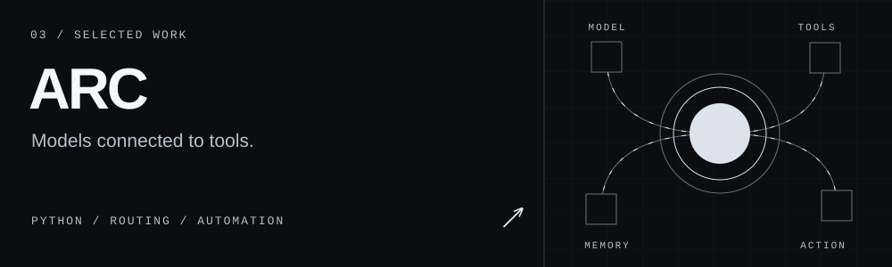
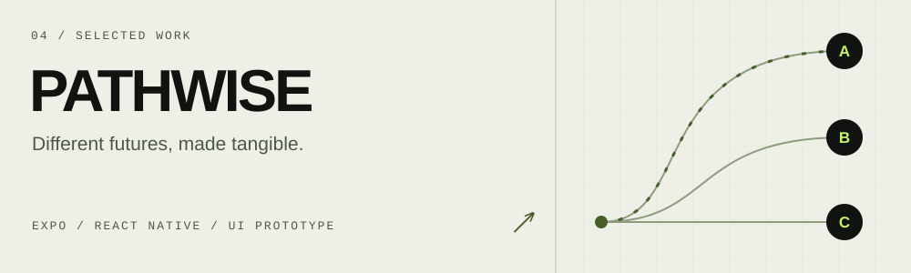
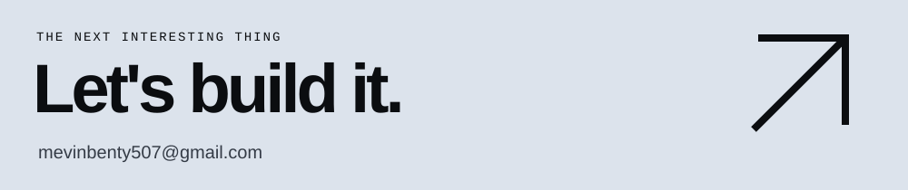

  

  <a href="#selected-work">Selected work</a> &nbsp; / &nbsp;
  <a href="#the-workbench">The workbench</a> &nbsp; / &nbsp;
  <a href="mailto:mevinbenty507@gmail.com">Start a conversation ↗</a>

I'm **Mevin Benty**. I build across local AI, desktop software, and the web. I like getting underneath the interface: the inference pipeline, the playback engine, the tools that make a product work.

 

## Selected work

<b>Inside ReactorX</b> — detection to the final blend

A local image-processing application with face detection, alignment, identity processing, optional restoration, color matching, and boundary blending. Built around a pipeline you can run on your own machine.

**Python · ONNX · Gradio**

[Explore the pipeline ↗](https://github.com/Mevinb/Reactor-X)

 

<b>Inside MediaHub</b> — one library for photos, video, and music

A Linux media suite with shared playback, persistent queues, photo editing, library search, and optional local OCR and face grouping. Built for Ubuntu, with native media controls.

**Python · PyQt6 · libVLC · SQLite**

[Explore the application ↗](https://github.com/Mevinb/mediaplayer)

 

<b>Inside ARC</b> — a model is only the beginning

A personal AI assistant connecting model routing, browser and computer tools, email triage, and persistent memory. Uses an OpenAI-compatible gateway, with permission gates for sensitive actions.

**Python · SQLite · Playwright · Model routing**

[Explore the architecture ↗](https://github.com/Mevinb/arc-angel)

 

<b>Inside PATHWISE</b> — explore the what-ifs

A career-pathway UI prototype with branching conversations, route comparisons, and reversible what-if scenarios. Uses local sample data and deterministic logic; it is a prototype, not a live advisory service.

**TypeScript · React Native · Expo**

[Explore the prototype ↗](https://github.com/Mevinb/iqooo)

 

## The workbench

| Surface | Tools I build with |
| :--- | :--- |
| Interfaces | TypeScript, JavaScript, React, Next.js, React Native, Expo |
| Engines | Python, Node.js, ONNX, PyQt6, libVLC |
| Infrastructure | SQLite, Docker, Linux, Git, GitHub Actions |

The interesting part is where these meet: a native interface around a local model, a media library around a playback engine, or an agent that can use the tools on your machine.

[Browse all repositories ↗](https://github.com/Mevinb?tab=repositories)

 

<b>Off duty</b> — music &amp; a little less seriousness

### On the headphones

<!-- SPOTIFY_START -->

  <b>Nothing playing right now</b>

<!-- SPOTIFY_END -->

### Intermission

<!-- MEME_SECTION_START -->

<!-- MEME_SECTION_END -->

 

  <a href="mailto:mevinbenty507@gmail.com">Email</a> &nbsp; / &nbsp;
  <a href="https://www.linkedin.com/in/mevin-benty-17305a322">LinkedIn</a> &nbsp; / &nbsp;
  <a href="https://x.com/mevinb">X</a> &nbsp; / &nbsp;
  <a href="https://www.instagram.com/mevinn._">Instagram</a> &nbsp; / &nbsp;
  <a href="https://youtube.com/@mevinb">YouTube</a>
   Discord · qb7702

How this README is made

Original vector artwork, CSS animation inside SVG images, native Markdown links, and expandable HTML sections. The illustrations are conceptual diagrams, not product screenshots or live telemetry. Motion respects the browser's reduced-motion preference; every image has a static composition and alternative text.

The artwork lives in this repository. No external rendering service, JavaScript, or embedded website is needed for the design. Regenerate it with `python3 scripts/render_profile.py`. See [the design notes](docs/profile-design.md).

